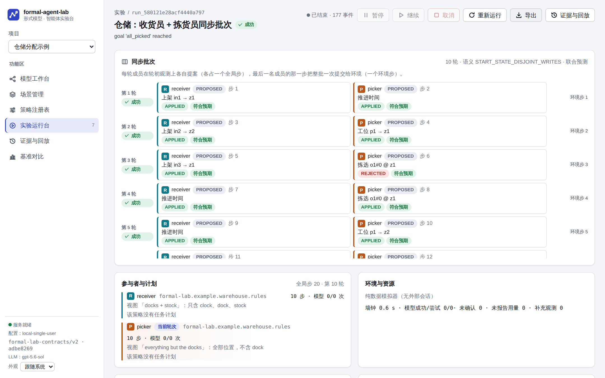
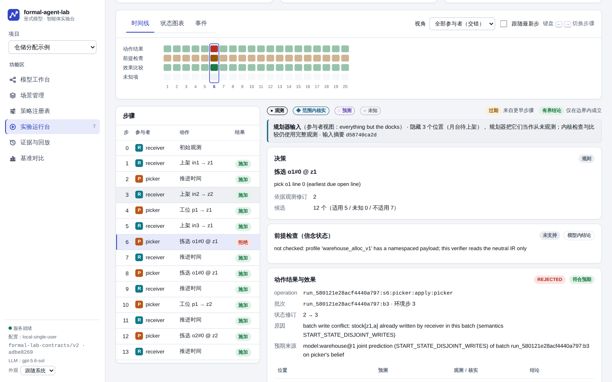
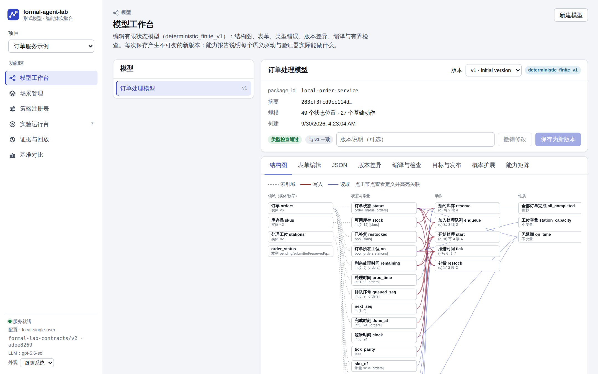
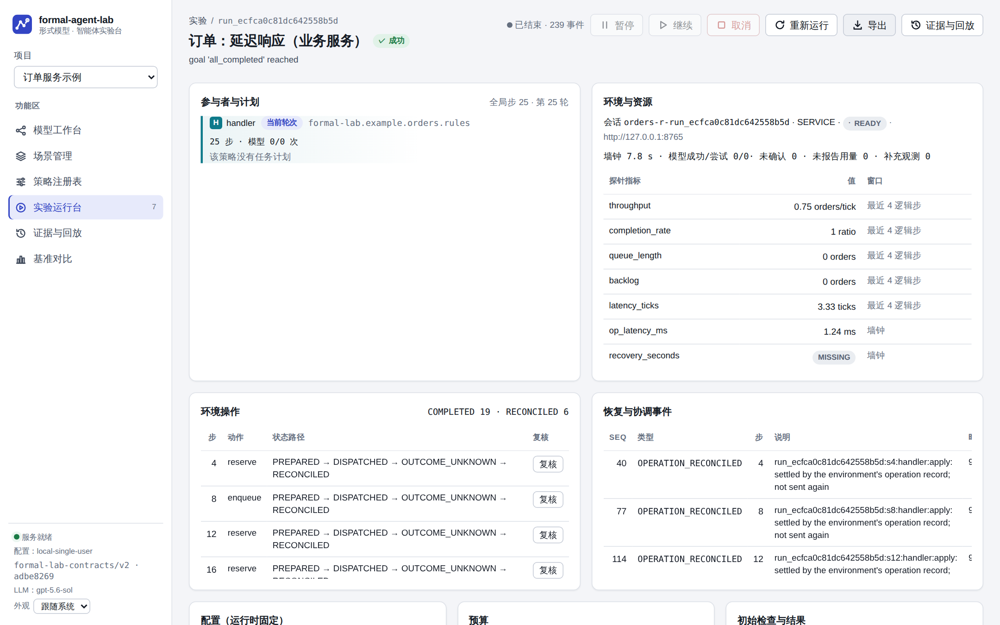
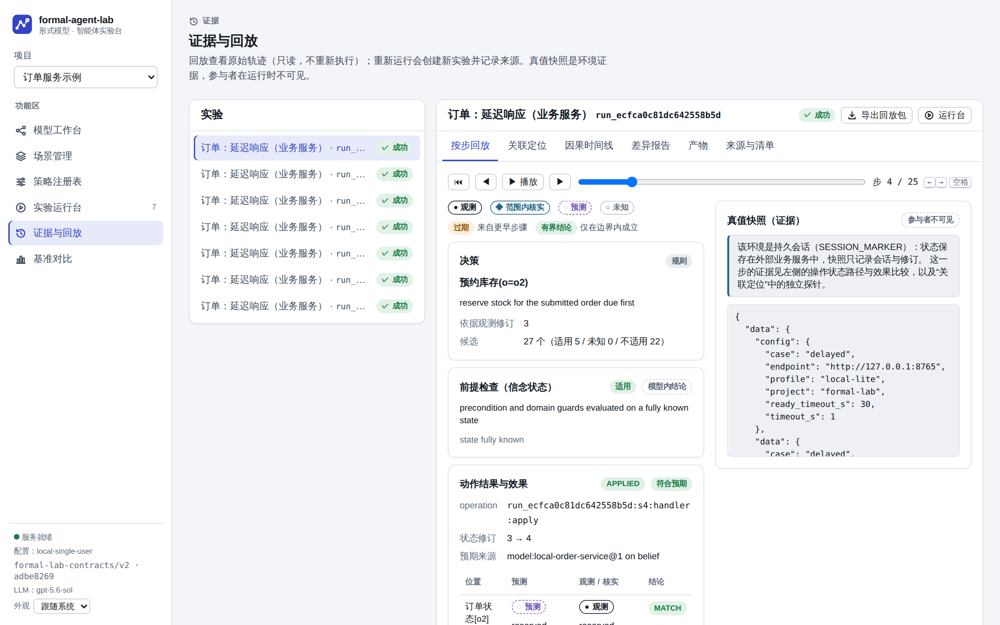
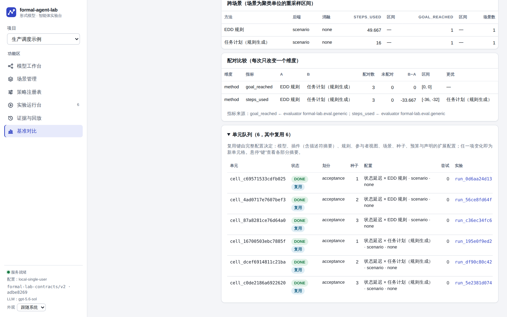
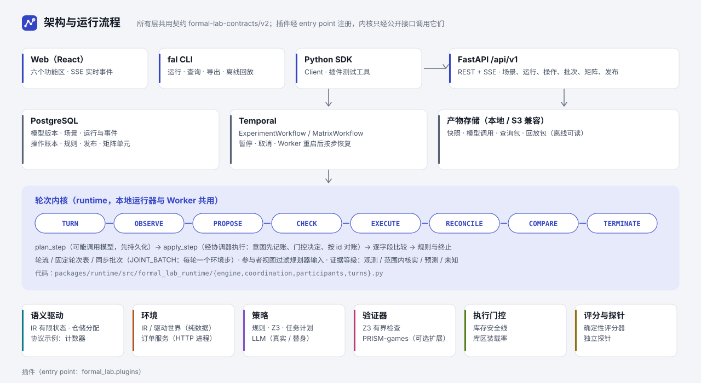

<p align="center">
  
</p>

<p align="center">
  <a href="https://github.com/3351666087/formal-agent-lab/actions/workflows/ci.yml"></a>
  <a href="LICENSE"></a>
</p>

<p align="center">
  <b>演示</b>：上方动画（可编辑 SVG）· <a href="docs/assets/demo.mp4">视频 MP4（1080p，20 s）</a> · <a href="docs/assets/demo.html">网页预览（可暂停、拖动）</a> · <a href="docs/assets/demo-cover.png">静态封面</a>
</p>

# formal-agent-lab

**从形式模型出发，让智能体的每一步都可检查、可比较、可回放。** 一个在本机运行的研究工作台：用有限状态模型描述一个业务世界（订单处理、仓储分配、生产调度……），先做类型检查与有界查询；再让一个或多个参与者（规则、Z3 规划、任务计划、LLM 策略）在纯数据模拟器或真实的本地业务服务中行动；每个动作的效果与模型预测逐字段比较，差异变成修订建议与回归案例；整个过程是一条带因果链的事件轨迹，可以导出成回放包离线阅读。

- **它是**：单用户、本地优先的实验平台与建模引擎（PostgreSQL + Temporal + FastAPI + React，全部在本机或本地虚拟机）；模型语义、环境、策略、验证器、执行门控、评分器都是可替换的插件。
- **它不是**：通用智能体框架或托管服务；不需要 LLM（LLM 策略是可选插件，另有确定性替身）；有界检查只在给定步数内给出结论，不宣称无界的正确性。

> 本页的截图和动画都来自这个仓库在本机上的真实运行：截图由 [`scripts/capture_screens.py`](scripts/capture_screens.py) 驱动 Web 界面走完真实流程后生成；动画里的数字取自订单服务示例（工位 p2 实际半速、模型按正常速度预测）的运行与 [`docs/execution/evidence/phase3/g3-release.json`](docs/execution/evidence/phase3/g3-release.json)。示例项目的数据是种子数据，结果是真实结果。

## 真实界面

<table>
<tr>
<td width="50%"><br><sub><b>实验运行台 · 仓储同步批次</b>：收货员与拣货员每轮在同一观测上各自提案，一轮一个环境步；成员结果、联合预测比较与参与者颜色。</sub></td>
<td width="50%"><br><sub><b>步骤详情</b>：参与者视图隐藏了哪些位置、字段级效果比较（● 观测 · ◆ 范围内核实 · ◌ 预测 · ○ 未知）。</sub></td>
</tr>
<tr>
<td><br><sub><b>模型工作台</b>：结构图（领域 → 状态 → 动作 → 性质）、版本差异、编译与有界检查、能力报告。</sub></td>
<td><br><sub><b>订单服务恢复</b>：每个应答都晚于客户端超时 → 结果未知 → 按操作 id 查询对账（RECONCILED），从不重复发送。</sub></td>
</tr>
<tr>
<td><br><sub><b>证据与回放</b>：按步回放、关联定位、因果时间线、差异报告、产物与来源清单；回放包可离线读取。</sub></td>
<td><br><sub><b>基准对比</b>：场景 × 策略 × 种子矩阵、配对比较；同一完整配置的单元格被复用并标明来源。</sub></td>
</tr>
</table>

深色模式与窄屏：[run-batch-dark.png](docs/assets/screens/run-batch-dark.png) · [landing-dark.png](docs/assets/screens/landing-dark.png) · [run-narrow.png](docs/assets/screens/run-narrow.png)。

## 功能地图

| 功能区 | 能做什么 | 入口 |
|---|---|---|
| 模型工作台 | 编辑有限状态模型（结构图 / 表单 / JSON），类型检查、版本差异、Z3 有界查询与成本最优、能力报告、发布检查（必需检查与必需成立的性质分开记录） | Web · `fal model` · `fal release` |
| 场景管理 | 固定模型版本、环境、参与者（策略、动作范围、**视图**）、轮次（轮流 / 固定轮次表 / **同步批次**）、执行门控、预算、终止条件 | Web · API |
| 策略注册表 | 插件描述符：能力、配置 schema、版本与兼容性；项目策略配置固定插件版本 | Web · `fal plugins` |
| 实验运行台 | Temporal 持久运行：暂停 / 继续 / 取消 / 重跑，Worker 被杀后按步恢复；操作账本、对账与人工复核；批次轮次 | Web · `fal run` · `fal ops` |
| 证据与回放 | 事件因果链、按步回放、效果差异与修订建议、回归案例、导出回放包并离线阅读 | Web · `fal export` · `fal replay` |
| 基准对比 | 矩阵队列（失败可重跑、增量合并）、配对比较与区间、消融；复用键覆盖模型、插件、规则、视图、场景、种子、预算与扩展配置 | Web · `fal matrix` |

## 快速开始（Ubuntu 24.04，或 macOS 上的 Colima 虚拟机）

```bash
bash scripts/bootstrap-dev-vm.sh && make bootstrap
make doctor                        # 本地 profile 是否可用、资源与端口
make demo                          # 无需任何服务：有界检查 + 策略比较
make services-up && make dev-up    # 开发栈 → http://127.0.0.1:5173（含三个示例项目）
make orders-up                     # 本地订单服务（持久业务环境）→ 127.0.0.1:8765
```

同样的流程也可以只用命令行（[`scripts/product_flow_evidence.py`](scripts/product_flow_evidence.py) 就是这样跑的）：

```bash
fal run start --project 仓储分配示例 --scenario "仓储：收货员 + 拣货员同步批次" --wait
fal run batches <run_id>                    # 每轮成员、状态、环境步与结果
fal export <run_id> -o wh.replay.zip        # 自包含回放包
fal replay verify wh.replay.zip && fal replay batches wh.replay.zip   # 离线读取
```

## 架构与运行流程

<p align="center"></p>

每个全局逻辑步是一个参与者的回合：`plan_step` 决定提案（可能调用模型，先持久化）；`apply_step` 经协调器执行——意图先记账、执行门控在发送前决定、应答丢失时按操作 id 查询对账——然后逐字段比较效果、评估规则与终止条件。本地运行器与 Temporal Worker 调用同一套引擎，所以两条路径的轨迹一致。契约 `formal-lab-contracts/v2`（Pydantic → JSON Schema → TypeScript）贯穿所有层；插件经 entry point 注册，接入方式见[插件接入指南](docs/architecture/plugin-integration.md)。

## 文档

- **阶段三交接（进行中）**：[docs/handoff/phase3-draft.md](docs/handoff/phase3-draft.md) · 任务书 [docs/execution/phase-3a.md](docs/execution/phase-3a.md) · 证据 [docs/execution/evidence/phase3/](docs/execution/evidence/phase3/)
- **设计系统**：[docs/design-system.md](docs/design-system.md)（tokens、组件、图表、页面、媒体生成命令、基准截图）· [Figma 设计文件](https://www.figma.com/design/uuV6JeilZQkhnIQcJYEUET)
- **阶段二（历史验收）**：[docs/handoff/phase2.md](docs/handoff/phase2.md) · [验收](docs/acceptance-phase2.md) · 阶段一 [phase1.md](docs/handoff/phase1.md)
- **使用与运维**：[入门](docs/getting-started.md) · [本地开发](docs/local-development.md) · [部署](docs/deployment.md)
- **接口**：[契约 v2](docs/contracts/v2.md)（[v1](docs/contracts/v1.md) 冻结）· [插件接入](docs/architecture/plugin-integration.md) · [能力矩阵](docs/architecture/capability-matrix.md) · [观测语义](docs/architecture/observation-semantics.md) · [决策记录](docs/execution/decisions.md)
- **复用与许可**：[复用记录](docs/reuse-ledger.md) · [第三方许可](docs/licenses.md)

许可：[Apache License 2.0](LICENSE)（另见 [NOTICE](NOTICE)；选择理由见决策 D-014）。第三方组件以未修改的官方发行物使用，各自的许可见复用记录与许可证清单。
